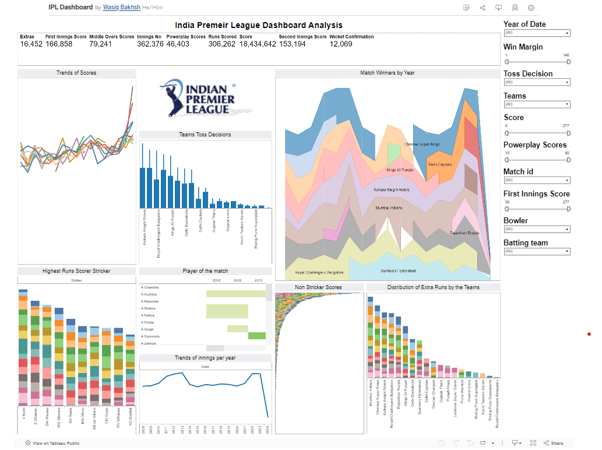
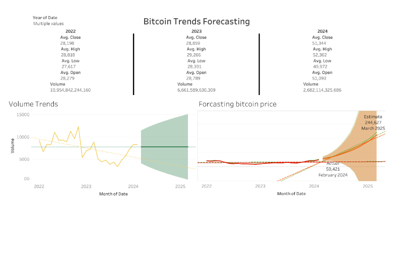
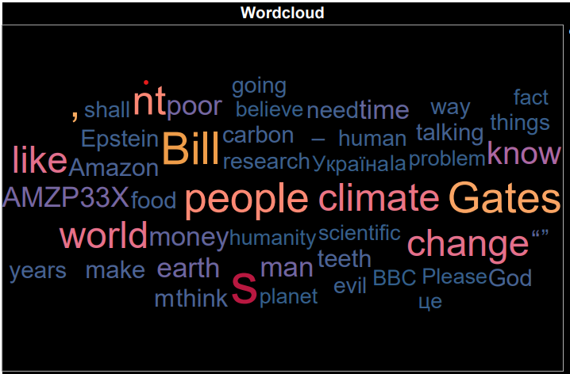
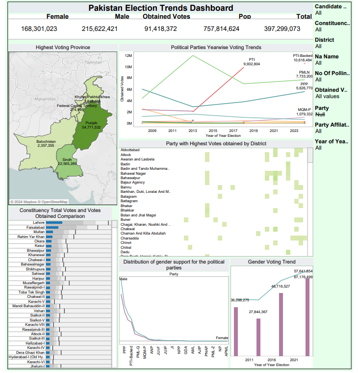
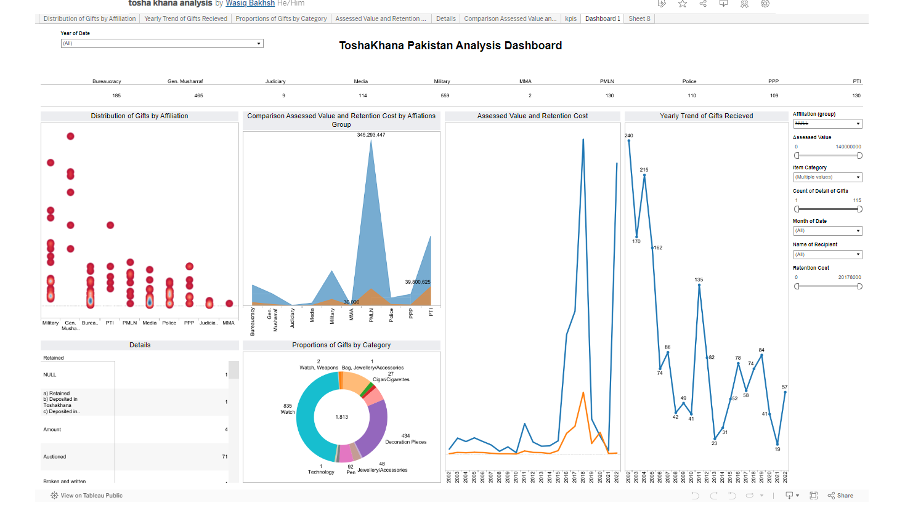

# Data Analyst
## Skills
### Soft Skills
#### Analytical Thinking , Problem-Solving , Communication , Collaboration , Attention to Detail ,Time Management
#### Curiosity , Adaptability , Critical Thinking , Business Acumen , Empathy , Ethical Consideration

### Programming Languages: 
Python, Sql

### Libraries/Frameworks: 
Pandas, Numpy, Matplotlib, Seaborn, Scikit learn, NLTK

### Tools / Platforms: 
Tableau, PowerBI, Microsoft Offce, SPSS, MySQL

### Databases:
Relational Databases

## Education

### Institute of Managment Sciences Peshawar, PAKISTAN
Data Science Bachelors July 2021 - Present
CGPA: 3.2

## Latest Experience
### House of Brands Media | Data Analyst Lisbon, Portugal | Feb 2024 - Apr 2024

Developed Tableau dashboards to monitor key marketing KPIs and performance metrics, providing
stakeholders with real-time insights for informed decision-making.

Identified trends and patterns in marketing data to optimize marketing strategies, resulting in a 25%
increase in lead generation.

Collaborated with cross-functional teams to interpret data Findings and develop actionable
recommendations for campaign optimization and budget allocation.

## Projects / Open-Source

### Superstore Exploratory Data Analysis and Model Training | Python
(Pandas,Seaborn,Matplotlib,KNN Regressor)

Conducted Exploratory Data Analysis (EDA) to understand trends, correlations, and anomalies in
superstore data. Additionally, developed and trained a Linear Regression model to forecast gross income
based on identified patterns and variables. Through collaboration with the client, you ensured alignment
of analysis and models with their unique business objectives.

[Link](https://www.linkedin.com/feed/update/urn:li:activity:7178131306281615360)

### IPL Data Analysis | Tableau SQL Pyhton
Developed a comprehensive Tableau dashboard analyzing IPL data, unveiling key insights into team
performance and player trends. Leveraged data visualization techniques to present intricate cricket
analytics efectively.

[VizLink](https://public.tableau.com/app/profile/wasiq6891/viz/IPLDashboard_17124079239120/Dashboard1)

### Bitcoin Trends Forecasting | Python Tableau
Leveraged Yahoo Finance API (yFinance) to meticulously extract and analyze Bitcoin data, culminating
in comprehensive forecasts for future price highs and lows, alongside volume trends.

Demonstrated proficiency in data visualization using Tableau, crafting dynamic and intuitive charts that
elucidated intricate cryptocurrency trends, facilitating informed decision-making.

Applied advanced analytical techniques to forecast Bitcoin's performance for the year 2025, providing
valuable insights crucial for strategic planning and navigating the dynamic landscape of the
cryptocurrency market.

[VizLink](https://public.tableau.com/app/profile/wasiq6891/viz/BitcoinPriceForcasting/Dashboard1)

### Unnveiling Insights from Youtube Comments | Pyhton ETL Tableau 

I delved into the vibrant world of YouTube analytics! 🚀 Leveraging the YouTube Data API, I embarked on a journey through the latest video by Pakistan's top content creator, Ducky Bhai. 🎥 With data in hand, I traversed the intricate landscapes of sentiment analysis, transforming raw comments into insights that paint a vivid picture of audience engagement and emotion.

But it didn't stop there. Armed with insights, I ventured into the realm of data visualization, crafting captivating graphs that breathe life into the digital dialogue. From dynamic sentiment distribution charts to mesmerizing word clouds capturing the essence of viewer discourse, each visualization tells a story waiting to be discovered.

As I reflect on this journey, I'm reminded of the power of data to illuminate pathways to understanding and connection.

[KaggleLink](https://lnkd.in/dWzeq2Fm)

### Unnveiling Insights from Youtube Comments (2) | Pyhton ETL Tableau 

### COP28: Bill Gates on climate optimism, wealth and the human condition

Project leveraging Python, Tableau, and the YouTube API! 📊✨
Using Python, I extracted comments from the insightful BBC video "COP28: Bill Gates on climate optimism, wealth and the human condition." 🌍💬

After filtering out the most frequently used words using Python, I transformed the data into an engaging word cloud visualization using Tableau. 🎨☁️

This project showcases my expertise in data extraction, analysis, and visualization, as well as my passion for exploring important topics like climate change and human progress. 🌱💡

[Viz Link](https://public.tableau.com/app/profile/wasiq6891/viz/WordcloudbbcvideowithBillgates/Wordcloud)

### Play Store Health Products Web Scrapping | Python (Pandas , Google_Play_Scraper)

Unveil insights from health apps on Google Play Store! Utilized advanced web scraping for
comprehensive data gathering. Uncovered fascinating trends in user behaviour and feature popularity

[kaggle notebook link](https://lnkd.in/drk7bGkw)

###  Web Scraping & EDA on Punjab Universities 🎓

🔍 Project Overview:
I recently completed a fascinating project where I delved into the world of Punjab universities, combining web scraping and exploratory data analysis (EDA) to uncover insights into the education landscape. 🌐

💻 Web Scraping:
Utilizing web scraping techniques, I gathered comprehensive data on universities in Punjab, extracting valuable information on campuses, programs, and more. 🚀

📈 Exploratory Data Analysis (EDA):
With a keen eye for patterns and trends, I conducted in-depth exploratory data analysis on the collected dataset. Visualizations, statistical analysis, and data-driven insights were employed to unravel key aspects of the educational institutions. 📊

🏆 Key Achievements:
Identified the top universities based on the number of campuses.
Explored the distribution of academic programs across different institutions.
Unearthed interesting correlations and trends within the educational data.

🔗 Skills Demonstrated:
Web Scraping, Data Cleaning, Exploratory Data Analysis, Data Visualization, Python, Pandas, Seaborn.

🌐 Impact:
The project not only sharpened my technical skills but also provided valuable insights into the educational ecosystem of Punjab. Sharing this journey on LinkedIn to connect with fellow data enthusiasts and professionals in the education sector. 🤝

[Link to PDF](https://www.linkedin.com/feed/update/urn:li:activity:7168535576181252097/)

### Pakistan 2024 Elections Dashboard

Title: Analyzing the 2024 Elections in Pakistan: A Comprehensive Overview

Introduction:
Welcome to the Tableau dashboard offering an in-depth analysis of the highly consequential 2024 elections in Pakistan. This interactive visualization tool harnesses data extracted from the Dawn API, providing a multifaceted exploration of the electoral landscape during this pivotal moment in Pakistan's democratic history.

Key Metrics and Features:

Voter Turnout Dynamics:

Dive into voter turnout statistics to discern patterns of civic engagement across various regions and demographics.
Identify factors influencing voter participation and areas with notable fluctuations in turnout rates.
Explore temporal trends to understand the evolution of voter engagement throughout the electoral process.
Candidate Performance and Political Party Dynamics:

Analyze the performance of candidates and political parties, examining vote shares, seat distribution, and electoral margins.
Utilize comparative tools to contrast the performance of incumbent parties with emerging political forces.
Gain insights into voter preferences and the factors driving electoral success or failure for different candidates and parties.
Regional Dynamics and Electoral Geography:

Explore the electoral map of Pakistan, visualizing regional variations in voting behavior and outcomes.
Examine district-level data to uncover electoral hotspots, swing constituencies, and areas of political significance.
Identify demographic and socio-economic factors influencing voting patterns and electoral outcomes across different regions.
Demographic Analysis and Voter Profile Insights:

Conduct a nuanced analysis of the demographic composition of voters and candidates.
Explore voter preferences based on age, gender, ethnicity, and socio-economic status, providing valuable insights for targeted outreach and policy formulation.
Assess the representation of marginalized communities and minority groups in the electoral process, highlighting areas for inclusive democratic reforms.

[VizLink](https://public.tableau.com/views/PakistanElectionsTrends2024/Dashboard1?:language=en-GB&publish=yes&:sid=&:display_count=n&:origin=viz_share_link)

### Tosha Khana Pakistan Analysis Dashbaord
#### Title: Exploring Tosha Khana Pakistan: An Analytical Dashboard

Introduction:
Welcome to the Tosha Khana Pakistan Analysis Dashboard, an insightful tool meticulously crafted to delve into the intricacies of public fund management in Pakistan. This dashboard offers a detailed examination of Tosha Khana operations, shedding light on budget allocation, expenditure patterns, revenue generation, and the overall transparency and accountability of public finances.

Key Metrics and Features:

Budget Allocation and Expenditure Analysis:

Explore the distribution of public funds across various sectors and government departments.
Analyze expenditure trends to identify areas of priority and assess the effectiveness of resource allocation.
Revenue Generation and Taxation Insights:

Investigate the sources of government revenue, including taxes, customs duties, and other levies.
Assess the impact of taxation policies on revenue generation and fiscal sustainability.
Transparency and Accountability Measures:

Evaluate the level of transparency in Tosha Khana operations, including budgetary disclosures and financial reporting.
Examine mechanisms for accountability and oversight to ensure responsible use of public funds.
Economic Impact Assessment:

Examine the socioeconomic outcomes of Tosha Khana activities, such as infrastructure development and poverty alleviation.
Evaluate the effectiveness of government expenditure in achieving sustainable development goals.
Interactive Functionality and User Engagement:

Real-time Data Visualization:

Present dynamic visualizations of Tosha Khana data through interactive charts, graphs, and maps.
Allow users to explore data in real-time and gain actionable insights for decision-making.
Comparative Analysis Tools:

Enable users to compare Tosha Khana performance over different time periods or geographic regions.
Provide benchmarks against international standards to assess performance and identify areas for improvement.
Scenario Planning and Forecasting Capabilities:

Empower stakeholders to conduct scenario planning exercises and forecast future trends in Tosha Khana operations.
Facilitate risk assessment and mitigation strategies to ensure fiscal resilience.

[VizLink](https://public.tableau.com/views/toshakhanaanalysis/Dashboard1?:language=en-GB&:sid=&:display_count=n&:origin=viz_share_link)

## Certifications

Google Data Analytics - Coursera

IBM Data Analysis with Pyhton - Coursera

Getting Started with Data Analytics on AWS - Coursera

Fundamentals of Visualization with Tableau - Coursera
